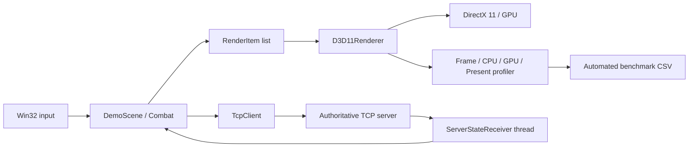

# DungeonSync

DirectX 11 클라이언트 렌더링, 전투 공간 탐색, TCP 상태 동기화와 성능 진단을 하나의 실행 가능한 데모로 구성한 C++20 포트폴리오 프로젝트입니다.

이 프로젝트의 목표는 화려한 콘텐츠의 양보다 온라인 게임 클라이언트의 기반 기술을 작은 범위 안에서 직접 구현하고, 병목을 수치로 확인하여 개선하는 과정을 보여주는 것입니다.

## 핵심 구현

- DirectX 11 기반 2.5D 렌더링 파이프라인
  - 직교 투영 카메라와 X-Z 지상 좌표계
  - 배경, 지면, 스프라이트 렌더 패스 분리
  - WIC 텍스처 로딩, HLSL 셰이더, 알파 블렌딩
  - 동적 인스턴스 버퍼와 `DrawIndexedInstanced`
- 전투 및 공간 탐색
  - Uniform Spatial Grid로 월드를 셀 단위로 분할
  - AABB 기반 Broad Phase 후보 수집
  - 거리 제곱 및 부채꼴 Narrow Phase 판정
  - 3개 전투방과 고정 용량 이펙트 풀
- TCP 클라이언트/서버
  - Winsock 자원의 RAII 관리
  - 고정 크기 패킷, sequence와 서버 위치 검증
  - 별도 수신 스레드와 최신 상태 소비
  - 클라이언트 예측 이동 후 서버 상태 보정
- 성능 진단 도구
  - Frame/CPU Submit/GPU/Present 구간 분리 측정
  - Avg, P95, P99, Max와 히치 임계치 기록
  - D3D11 비동기 timestamp query와 세대 번호 기반 샘플 격리
  - 자동 스트레스 시나리오와 CSV 결과 저장

## 구조



`Application`은 실행 흐름을 조정하고, 렌더링·게임플레이·네트워크·진단 기능은 각 하위 모듈에 분리했습니다. 네트워크 소켓과 COM 객체는 소유자가 수명을 관리하도록 구성했습니다.

## 조작

| 입력 | 기능 |
|---|---|
| 방향키 | 지상 이동 |
| `C` | 점프 |
| `X` | 기본 공격 |
| `E` | 부채꼴 공격 |
| `R` | 던전 재시작 |
| `F1`~`F4` | 100 / 1,000 / 3,000 / 10,000개 렌더링 스트레스 |
| `F5` | 스트레스 장면 종료 |
| `F6` | Instanced / Per-instance 제출 방식 전환 |
| `F8` | 자동 벤치마크 시작 |
| `F9` | 자동 벤치마크 취소 |
| `H` | Debug 빌드에서 50ms 히치 주입 |

## 빌드 및 실행

요구 환경은 Windows 10/11, Visual Studio 2022 C++ 도구 모음, CMake 3.25 이상입니다.

```powershell
Set-Location -LiteralPath "E:\Cpp Project\DungeonSync"
cmake --preset windows-x64
cmake --build --preset windows-x64-release
```

셰이더와 에셋은 저장소 루트 기준 상대경로로 로드하므로 실행 전 작업 폴더를 저장소 루트로 맞춰야 합니다.

서버:

```powershell
& ".\out\build\windows-x64\Release\DungeonSyncServer.exe"
```

별도 PowerShell에서 클라이언트:

```powershell
Set-Location -LiteralPath "E:\Cpp Project\DungeonSync"
& ".\out\build\windows-x64\Release\DungeonSyncClient.exe"
```

현재 서버는 포트 `27015`에서 단일 클라이언트를 수락하는 검증용 구조입니다.

## 렌더링 벤치마크

자동 벤치마크는 100, 1,000, 3,000, 10,000개 스프라이트를 Instanced Batch와 Per-instance 방식으로 각각 측정합니다.

- Release 빌드
- Immediate Present로 VSync 대기 제거
- 시나리오별 2초 워밍업
- 최소 3초 측정 및 각 프로파일러 600샘플 확보
- 동적 인스턴스 버퍼 용량: 1,024 → 4,096 → 16,384
- 모든 시나리오에서 Dropped Instance 0


### Release + Immediate 결과

| Instances | Mode | Draw Calls | Frame Avg | CPU Submit Avg | GPU Avg |
|---:|---|---:|---:|---:|---:|
| 1,000 | Instanced | 3 | 0.1010ms | 0.0054ms | 0.0345ms |
| 1,000 | Per-instance | 1,002 | 0.1112ms | 0.0118ms | 0.0433ms |
| 3,000 | Instanced | 3 | 0.1246ms | 0.0143ms | 0.0519ms |
| 3,000 | Per-instance | 3,002 | 0.1645ms | 0.0295ms | 0.0642ms |
| 10,000 | Instanced | 3 | 0.1477ms | 0.0382ms | 0.0657ms |
| 10,000 | Per-instance | 10,002 | 0.1599ms | 0.0778ms | 0.1232ms |

10,000개 기준으로 Draw Call을 10,002회에서 3회로 줄였고, CPU 렌더 명령 제출 평균은 50.9%, GPU 평균 시간은 46.7% 감소했습니다. 전체 Frame Avg 개선은 7.7%로 더 작습니다. 현재 장면의 GPU 부하가 가볍고 Present·메시지 처리 등 공통 비용이 프레임 시간에서 차지하는 비중이 크기 때문입니다.

100개 구간에서는 두 방식의 비용이 매우 작아 운영체제 스케줄링과 측정 잡음이 최적화 효과보다 크게 나타났습니다. 따라서 결론은 작은 개수의 단일 결과가 아니라 인스턴스 증가에 따른 CPU/GPU 비용 추세를 기준으로 판단했습니다.

원본 데이터:

- [`Benchmarks/results_release_immediate.csv`](Benchmarks/results_release_immediate.csv): 최종 비교용 Release/Immediate 결과
- [`Benchmarks/results_release_vsync.csv`](Benchmarks/results_release_vsync.csv): VSync가 Frame Avg 차이를 가리는 현상을 확인하기 위한 대조군

VSync 측정에서는 약 240Hz의 Present 대기가 전체 프레임 시간을 지배하여 두 방식 모두 약 4.17ms로 수렴합니다. 이 때문에 Draw Call 최적화 자체의 비용을 비교할 때는 Immediate 결과의 CPU/GPU 구간을 사용했습니다.

## 안정성과 히치 대응

- 인스턴스 버퍼는 필요한 용량을 2의 거듭제곱으로 확장하여 매 프레임 재생성을 방지합니다.
- 스프라이트 이펙트는 고정 용량 풀에서 재사용하여 전투 중 반복 할당을 줄입니다.
- GPU timestamp query는 결과를 기다리며 CPU를 막지 않고 `D3D11_ASYNC_GETDATA_DONOTFLUSH`로 회수합니다.
- 벤치마크 시나리오가 바뀔 때 측정 세대를 갱신하여 이전 GPU 결과가 다음 시나리오에 섞이지 않도록 했습니다.
- 강제 히치 주입으로 Max 및 임계치 초과 카운터가 실제 이상 프레임을 포착하는지 검증했습니다.

## 현재 한계와 확장 방향

- 서버는 단일 클라이언트용이며 다중 접속, 세션 관리, IOCP는 구현하지 않았습니다.
- 패킷은 현재 데모에 필요한 고정 크기 구조이며 범용 수신 누적 버퍼와 버전 협상은 후속 과제입니다.
- 렌더링 벤치마크는 최근 600샘플의 통계를 저장합니다. 장시간 전체 표본 누적과 반복 실행의 신뢰구간 계산은 후속 개선 대상입니다.
- 아트 리소스와 콘텐츠 규모보다 엔진 기능, 측정 가능성, 자원 수명과 실패 경로 검증에 범위를 집중했습니다.
