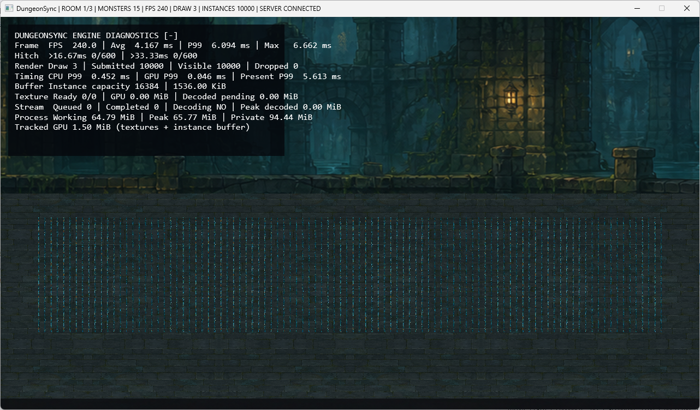
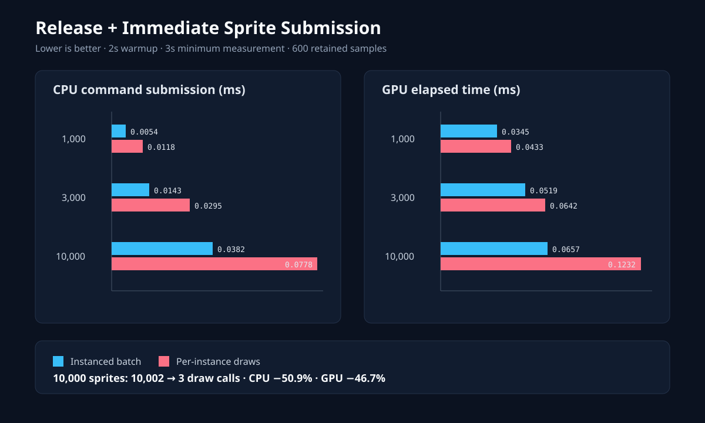
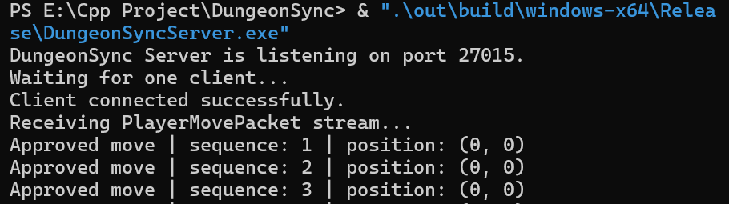
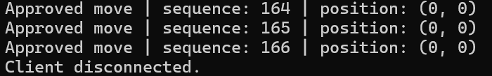
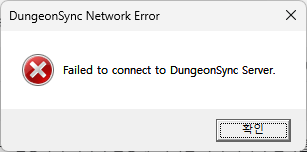
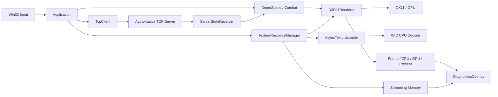

# DungeonSync Engine Lab

DirectX 11 온라인 게임 클라이언트의 렌더링, 리소스 스트리밍, 성능 진단, 메모리 관찰, TCP 상태 동기화를 **직접 구현하고 수치로 검증한 C++20 엔진 연구 포트폴리오**입니다.

이 프로젝트는 완성된 상용 엔진이나 기존 라이브 코드의 개선 사례가 아닙니다. 대신 작은 2.5D 던전 실행 환경에서 다음 질문을 재현 가능한 실험으로 다룹니다.

- 동일한 스프라이트 10,000개를 어떻게 적은 Draw Call로 제출할 수 있는가?
- 리소스 로딩 총량은 유지하면서 플레이를 멈추는 단일 프레임 히치를 줄일 수 있는가?
- 평균 FPS에 숨는 P99와 Max frame time을 어떻게 관찰할 것인가?
- 프로세스 메모리, CPU 디코딩 메모리, 엔진 추적 GPU 메모리를 어떻게 구분할 것인가?
- 렌더링 루프와 blocking TCP 수신을 어떻게 분리하고 안전하게 종료할 것인가?

> [Interactive Engine Code Map](https://sj97p.github.io/DungeonSync/) · [Repository](https://github.com/SJ97p/DungeonSync)


> DirectX 11 2.5D 전투 데모. 왼쪽은 런타임 진단 오버레이가 있는 클라이언트이고, 오른쪽은 이동 패킷을 검증한 서버의 `Approved move` 로그입니다.

## 핵심 결과

| 연구 항목 | Before / 비교군 | After / 적용군 | 검증 결과 |
|---|---:|---:|---|
| 텍스처 7장 런타임 로딩 | 동기 Frame Max `57.416ms` | 비동기 Frame Max `6.798ms` | Max 약 `88.2%` 감소, 16.67ms 초과 `1 → 0` |
| 스프라이트 10,000개 제출 | Per-instance `10,002` Draw Calls | Instanced `3` Draw Calls | 공통 geometry와 instance data 분리 |
| 동적 인스턴스 버퍼 | 초기 capacity `1,024` | 필요 시 `16,384` | 2배 성장, 10,000개 누락 `0` |
| 비동기 디코딩 메모리 | 관찰 불가 | Peak decoded `8.00MiB` | 완료 후 pending `0MiB` 복원 확인 |
| 추적 리소스 메모리 | 인스턴스 버퍼 `0.09MiB` | 텍스처 7장+버퍼 `24.50MiB` | OS 메모리와 엔진 추정치를 분리 표시 |

측정 환경과 드라이버에 따라 절대 수치는 달라질 수 있습니다. 목적은 특정 숫자를 일반화하는 것이 아니라 **동일 조건을 만들고 병목 구간을 분리해 개선 효과를 검증하는 과정**을 보여주는 것입니다.



## 기술적 초점

### 1. DirectX 11 2.5D 렌더링

- Win32 window, D3D11 device/context, swap chain과 back buffer 초기화
- 직교 투영 카메라와 X-Z 지상 좌표계
- Background → Ground → Sprite → Diagnostics → Present 패스 구성
- vertex/index/instance buffer와 `DrawIndexedInstanced`
- depth test/write, alpha blending, sprite transparency 처리
- D3D11 timestamp/disjoint query를 이용한 비동기 GPU 시간 측정

### 2. Instancing과 재현 가능한 성능 비교

동일한 `RenderItem` 배치를 두 방식으로 제출합니다.

- Instanced: 배경 1 + 지면 1 + 스프라이트 batch 1 = Draw Call 3
- Per-instance: 배경 1 + 지면 1 + 스프라이트 N = Draw Call N+2

100 / 1,000 / 3,000 / 10,000개 시나리오를 자동 실행하고 Frame, CPU Submit, GPU, Present를 분리해 CSV로 저장합니다. FPS가 VSync/Present에 가려져도 실제 제출 비용을 구분할 수 있도록 설계했습니다.



### 3. 비동기 텍스처 스트리밍과 히치 완화

동기 로딩 경로:

```text
Main Thread: File I/O → WIC Decode → D3D11 Upload → Resume Frame
```

비동기 로딩 경로:

```text
Main Thread Request
    → Bounded Request Queue
    → Worker Thread / COM MTA / WIC Decode
    → Bounded Completed Queue (RGBA8)
    → Main Thread / 최대 1개 Upload per Frame
    → Texture Cache
```

핵심 결정은 GPU API 전체를 무조건 작업 스레드로 옮기는 것이 아닙니다.

- CPU 디코드는 worker가 담당합니다.
- D3D11 texture/SRV 생성은 renderer를 소유한 main thread에서 수행합니다.
- 완료 결과를 프레임당 하나만 소비해 upload burst를 제한합니다.
- request/completion queue는 bounded queue로 구성해 메모리 증가에 상한을 둡니다.
- 종료 시 stop flag → `notify_all` → worker wake-up → `join` 순서를 지킵니다.

Release에서 동일한 텍스처 7장을 비교한 결과:

```text
Synchronous: total/stall 56.466ms, Frame Max 57.416ms
Asynchronous: request-to-ready 58.253ms, Frame Max 6.798ms
```

총 로딩 시간은 유사하지만 메인 스레드의 단일 프레임 정지를 제거했습니다. 즉, 작업량을 숨긴 것이 아니라 **플레이 루프와 작업을 분리하고 프레임 예산에 맞게 분산**한 결과입니다.

### 4. 런타임 엔진 진단 오버레이

`-` 키로 Direct2D/DirectWrite 기반 오버레이를 표시합니다.

- Frame FPS / Avg / P99 / Max
- 16.67ms / 33.33ms 초과 횟수
- Draw Calls / Submitted / Visible / Dropped instances
- CPU Submit / GPU / Present P99
- instance buffer capacity와 byte 크기
- texture state, queue, pending/peak decoded memory
- Windows Working Set / Peak Working Set / Private Bytes
- 엔진이 크기를 알고 있는 texture + instance buffer의 tracked GPU bytes

장면 GPU timestamp query를 끝낸 뒤 오버레이를 그려, 진단 UI 자체가 장면 GPU 측정값에 포함되지 않도록 구간을 분리했습니다.

### 5. 메모리 관찰과 해석

| 지표 | 의미 | 주의점 |
|---|---|---|
| Working Set | 현재 실제 RAM에 resident한 프로세스 페이지 | OS가 trimming할 수 있음 |
| Peak Working Set | 실행 이후 Working Set 최고치 | 일시적인 디코딩 peak 포함 |
| Private Bytes | 다른 프로세스와 공유할 수 없는 private commit | Working Set보다 크게 보일 수 있음 |
| Decoded Pending / Peak | GPU upload를 기다리는 CPU RGBA8 픽셀 | 완료 후 pending은 0으로 복원 |
| Tracked GPU | 리소스 매니저 texture + instance buffer 추정치 | 전체 VRAM 사용량이 아님 |

지면을 기본 텍스처로 복귀해도 cache와 high-water instance buffer는 재사용을 위해 유지합니다. 메모리가 즉시 줄지 않는 현상을 곧바로 누수로 단정하지 않고 소유 객체와 재사용 정책을 함께 확인합니다.

### 6. 전투 공간 탐색

- `floor(world / cellSize)` 기반 Uniform Spatial Grid
- 공격 원을 감싸는 AABB cell range로 broad-phase 후보 수집
- 거리 제곱 비교와 dot product 기반 narrow-phase
- 원형 공격과 방향성 부채꼴 공격이 동일한 후보 수집 경로를 재사용

Broad phase는 정확한 피격 판정이 아니라 **놓치지 않는 저비용 후보 수집 단계**이며, narrow phase가 실제 공격 shape를 판정합니다.

### 7. TCP 상태 동기화와 수명 관리

- Winsock과 `SOCKET`을 RAII 객체로 관리
- 20Hz `PlayerMovePacket`과 sequence 전송
- 서버에서 이동량을 검증한 authoritative snapshot 반환
- blocking `recv`를 별도 `ServerStateReceiver` thread에서 수행
- 최신 snapshot만 mutex로 게시하고 main thread에서 소비
- 작은 위치 오차는 보간하고 큰 오차/거부 상태는 snap
- 종료 시 `shutdown`으로 blocking `recv`를 깨운 뒤 worker `join`

현재 서버는 학습 목적의 단일 클라이언트·고정 크기 패킷 범위입니다. TCP의 신뢰성과 순서 보장은 메시지 경계 보장을 의미하지 않으므로, 가변 패킷 확장에는 누적 수신 버퍼와 header validation이 필요합니다.

#### 연결·검증·종료 증거



서버가 먼저 `listen` 상태가 된 뒤에만 클라이언트 연결을 허용합니다. 연결 후 `PlayerMovePacket` 수신과 sequence 기반 이동 검증을 로그로 확인합니다.

<details>
<summary>정상 종료와 서버 미실행 시 처리 보기</summary>

**정상 종료** — 클라이언트가 종료되면 서버가 연결 해제를 감지합니다.



**연결 실패** — 서버가 실행되지 않은 상태에서는 클라이언트를 계속 실행하지 않고 연결 오류를 표시합니다.



</details>

## 구조



## 주요 클래스 책임

| 클래스 | 책임 |
|---|---|
| `Application` | composition root, 초기화/종료 순서, main loop 조정 |
| `D3D11Renderer` | DX11 자원, 렌더 패스, GPU query, Present |
| `WicTextureLoader` | WIC decode와 D3D11 texture creation API 분리 |
| `AsyncTextureLoader` | worker, bounded queues, CPU decode, 안전한 종료 |
| `TextureResourceManager` | resource state/cache, main-thread upload, 통계 |
| `DiagnosticsOverlay` | D2D/DirectWrite 기반 런타임 표시 |
| `FrameTimeProfiler` | 최근 600샘플 percentile/hitch 통계 |
| `ProcessMemorySampler` | Windows Working Set/Private Bytes snapshot |
| `SpatialGrid` | cell index와 AABB 후보 조회 |
| `CombatSystem` | 거리/방향 narrow-phase와 피해 적용 |
| `TcpClient` | client socket RAII와 전송 |
| `ServerStateReceiver` | blocking receive worker와 latest snapshot 게시 |

## 조작법

| 키 | 기능 |
|---|---|
| 방향키 | 이동 |
| `C` | 점프 |
| `X` | 기본 공격 |
| `E` | 부채꼴 공격 |
| `R` | 던전 재시작 |
| `1`~`4` | 100 / 1,000 / 3,000 / 10,000개 렌더링 부하 |
| `5` | 스트레스 장면 종료 |
| `6` | Instanced / Per-instance 전환 |
| `7` | 자동 벤치마크 시작 |
| `8` | 자동 벤치마크 취소 |
| `9` | 텍스처 7장 동기 로딩 비교 |
| `0` | 동일 7장 비동기 로딩 / cache 적용 |
| `-` | 엔진 진단 오버레이 표시/숨김 |
| `=` | 기본 지면 텍스처 복귀 |

## 빌드 및 실행

요구 환경: Windows 10/11, Visual Studio 2022 C++ toolchain, CMake 3.25 이상

```powershell
Set-Location -LiteralPath "E:\Cpp Project\DungeonSync"
cmake --preset windows-x64
cmake --build --preset windows-x64-debug
```

서버와 클라이언트를 별도 터미널에서 실행합니다.

```powershell
& ".\out\build\windows-x64\Debug\DungeonSyncServer.exe"
& ".\out\build\windows-x64\Debug\DungeonSyncClient.exe"
```

Release:

```powershell
cmake --build ".\out\build\windows-x64" --config Release
& ".\out\build\windows-x64\Release\DungeonSyncServer.exe"
& ".\out\build\windows-x64\Release\DungeonSyncClient.exe"
```

## 검증 자료

- [비동기 스트리밍·진단 요구사항과 설계 기록](Docs/AsyncResourceStreamingRequirements.md)
- [Release Immediate 결과](Benchmarks/results_release_immediate.csv)
- [Release VSync 결과](Benchmarks/results_release_vsync.csv)
- [렌더링 벤치마크 그래프](Docs/Images/rendering_benchmark.svg)
- [Interactive Code Map](https://sj97p.github.io/DungeonSync/)

## 한계와 정직한 범위

- 기존 상용 엔진이나 라이브 레거시 코드를 개선한 사례가 아니라 독립 연구 프로젝트입니다.
- 서버는 단일 클라이언트 실험이며 IOCP 기반 대규모 접속 구조가 아닙니다.
- `Tracked GPU`는 엔진이 등록한 texture와 instance buffer만 포함하며 전체 VRAM이 아닙니다.
- 시작 시 renderer가 직접 로딩한 기본 texture와 동기 비교용 texture set은 resource manager 집계에 포함되지 않습니다.
- 에셋은 엔진 기능을 확인하기 위한 포트폴리오용 시각 자료이며 아트 제작 역량을 주장하지 않습니다.
- 측정 결과는 현재 Windows 장비의 결과이며 다른 하드웨어에 그대로 일반화하지 않습니다.

## 채용 업무와의 연결

| 공고의 기술 과제 | DungeonSync에서 검증한 내용 |
|---|---|
| DX11 엔진 기능 개선 | 렌더 패스, instancing, GPU query, D2D diagnostics |
| 렌더링 최적화 | 10,000개 동일 시나리오의 submission mode 비교 |
| 클라이언트 안정성 | bounded queue, RAII, shutdown/join, 실패 상태 처리 |
| 메모리 최적화·관찰 | process counters, decoded peak, tracked resource bytes |
| 공통 툴·시스템 | 런타임 diagnostics overlay, automated CSV benchmark |
| 소켓/클라이언트·서버 | TCP packet, server validation, receive worker, reconciliation |
| 리팩터링 역량 | CPU decode와 GPU upload 책임 분리, resource state/cache 계층화 |

프로젝트의 핵심 주장은 “완성된 엔진을 만들었다”가 아니라 다음과 같습니다.

> 엔진 기능의 병목을 재현하고, 측정 구간을 분리하고, 수명과 스레드 경계를 설계한 뒤, 개선 효과와 한계를 수치로 설명할 수 있습니다.
